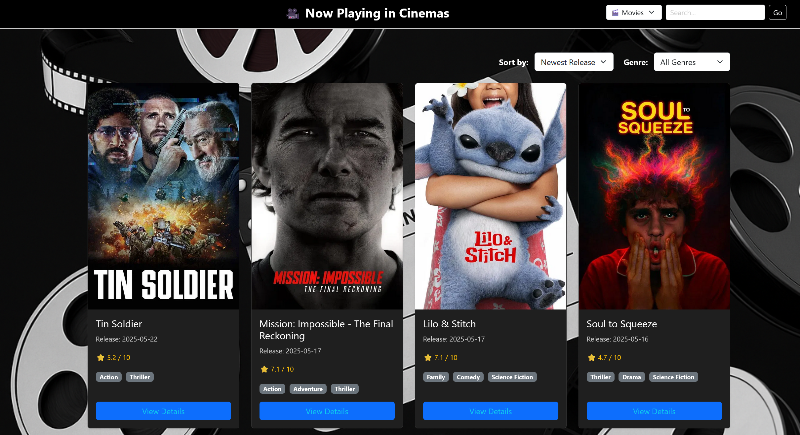
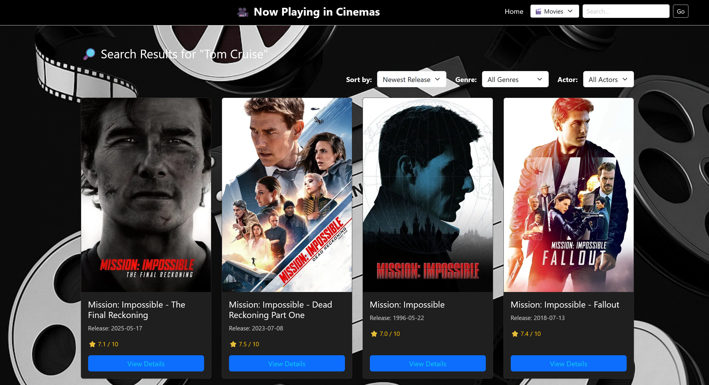
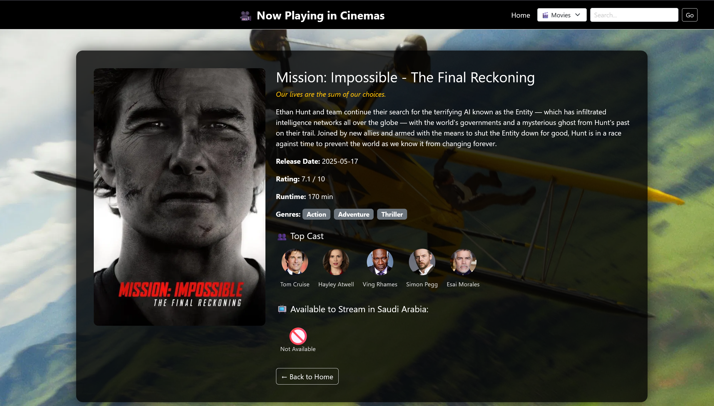
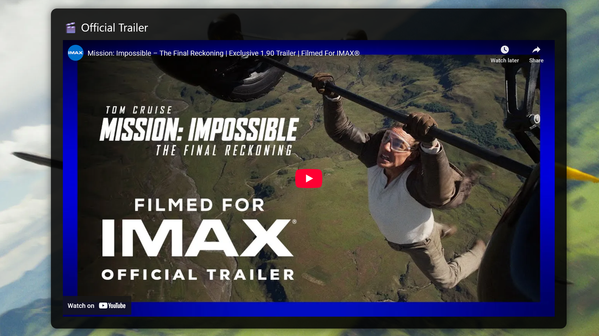

# 🎬 Flask Movie Hub

A Flask web app to explore movies currently playing in cinemas using the TMDB API. Users can browse movie details, watch trailers, check available streaming platforms in Saudi Arabia, and search by title or actor with autocomplete.

## 🌐 Live Demo

🔗 [View Live Site on Render](https://flask-movie-app.onrender.com)

## 🚀 Features

- 🔍 Search by movie or actor with autocomplete
- 🎞️ View movie details, release date, and ratings
- 📺 See where to stream (Netflix, Shahid, OSN, etc.)
- 🎬 Watch trailers from YouTube
- 🧙‍♂️ Filter by genre, rating, or cast
- 📱 Mobile-responsive UI with Bootstrap

## 🖼️ Screenshots

| Home Page                              | Search Results                             |
|----------------------------------------|--------------------------------------------|
|    |    |

**Movie Detail Page (Overview & Streaming)**  
  



## ⚙️ Tech Stack

- **Backend**: Python, Flask
- **Frontend**: Bootstrap 5, Jinja2
- **API**: TMDB (The Movie Database)
- **Other**: .env config, autocomplete, responsive design

## 🛠️ Setup Instructions

1. **Clone the repo**:
   ```bash
   git clone https://github.com/Srameegy/flask-movie-app.git
   cd flask-movie-app
   ```

2. **Create a virtual environment**:
   ```bash
   python -m venv venv
   source venv/bin/activate  # On Windows: venv\Scripts\activate
   ```

3. **Install dependencies**:
   ```bash
   pip install -r requirements.txt
   ```

4. **Set up your `.env` file**:
   ```
   TMDB_API_KEY=your_tmdb_api_key_here
   ```

5. **Run the app**:
   ```bash
   flask run
   ```

## 📦 Folder Structure

```
flask-movie-app/
│
├── static/
│   └── screenshots/
├── templates/
├── .gitignore
├── .env               # Not committed
├── main.py
├── README.md
└── requirements.txt
```

## 📄 License

This project is licensed for educational and demo purposes.
